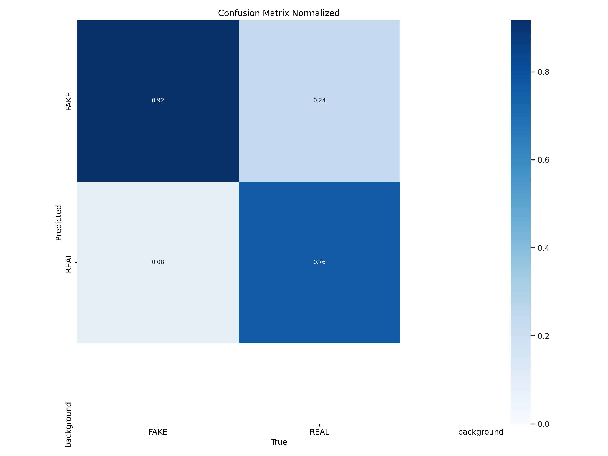

<!-- Project title -->
# Project Title

DEEP FAKE IMAGE DETECTOR ROBUST AGAINST ADVERSARIAL AND LATENT CODE MODIFICATION ATTACKS

<!-- experiments -->
# Experiments

## Dataset : CiFAKE

A dataset containing 60,000 synthetically-generated images and 60,000 real images.
<!-- link -->
[Visit CiFAKE Dataset](https://www.kaggle.com/datasets/birdy654/cifake-real-and-ai-generated-synthetic-images)

<!-- experiment 1 -->
### Experiment 1

Task: Train a model on the dataset and evaluate its performance.

## Models

### 1. ViT
<!-- accuracy -->
Accuracy: 0.98

### 2. EfficientNet

Accuracy: 0.88

### 3. YOLO-V11

(This model was used for further experiments)

Accuracy: 0.92

### Experiment 2

Task: added gaussian noise to the Test dataset images and evaluated the YOLO model's performance.

Mean: 0.0, Standard Deviation: 1.0
<!-- sample images -->

### Accuracy: 0.78

### Experiment 3

Task: Making the model robust

#### Approach 1: Feature Dropping with least correlations

Max correlation: 0.2645
Min correlation: 0.00054

Threshold used: 0.02
pixels dropped: 12%

### Accuracy: 0.73

Threshold used: 0.04
pixels dropped: 28%

### Accuracy: 0.69

Some more experiments and results...

stdev: 25.0
threshold: 0.035
pixels dropped: 25%

### Accuracy: 69%

stdev: 25.0
pixels dropped: 17%

### Accuracy: 74%

stdev: 25.0
pixels dropped: 12%

### Accuracy: 0.69 and 0.71 (with and without resolution reduction)

#### Approach 2: Feature Dropping + Augmentations

stdev: 25.0
threshold: 0.02
pixels dropped: 9%

First feature dropping, then augmentations

### Accuracy: 0.68

First augmentations, then feature dropping

stdev: 25.0
threshold: 0.015
pixels dropped: 9%

### Accuracy: 0.679

stdev: 1.0
threshold: 0.01
pixels dropped: 5%

# Accuracy: 0.73 

#### Approach 3: Feature Dropping + Augmentations + Adversarial Training

50% of the augmentations were done by gaussian noise

stdev: 1.0
threshold: 0.015
pixels dropped: 9%

### Accuracy: 0.85

